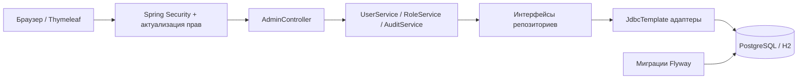

# Corporate Admin

Административная панель корпоративного сервиса на **Java 21 / Spring Boot 3.5.16**. Русскоязычный адаптивный интерфейс, управление пользователями и ролями, проверка разрешений на сервере и журнал изменений.

## Возможности

- Вход и выход через Spring Security, сессии с тайм-аутом 30 минут.
- Создание сотрудников, изменение имени, назначение нескольких ролей, блокировка и сброс пароля.
- Создание и редактирование ролей с набором разрешений; права ролей объединяются.
- Системная роль `ADMIN` защищена от изменения. Нельзя отключить или лишить роли последнего активного администратора.
- Изменения прав вступают в силу на следующем запросе, без повторного входа.
- Блокировка и сброс пароля завершают старую сессию при следующем запросе.
- Журнал последних 200 изменений: время, инициатор, действие и объект. Полная история остаётся в БД.
- Пароли хешируются BCrypt; CSRF включён, формы используют токены, SQL параметризован, текст экранируется Thymeleaf.
- Flyway управляет схемой; H2 используется для локального запуска, PostgreSQL — для отдельного окружения.

## Быстрый запуск

Требуется **JDK 21**. Maven Wrapper загрузит Maven 3.9.11; первая сборка требует интернет. Совместимость Spring Boot описана в [официальной документации](https://docs.spring.io/spring-boot/3.5/system-requirements.html).

### Windows / PowerShell

Откройте терминал в каталоге проекта. Убедитесь, что `JAVA_HOME` указывает на JDK 21.

```powershell
$env:ADMIN_USERNAME = 'admin'
$secret = Read-Host 'Начальный пароль администратора (12–64 символа)' -AsSecureString
$env:ADMIN_PASSWORD = [System.Net.NetworkCredential]::new('', $secret).Password
.\mvnw.cmd spring-boot:run
```

### Linux / macOS

```bash
chmod +x mvnw
export ADMIN_USERNAME=admin
read -rs -p 'Начальный пароль администратора: ' ADMIN_PASSWORD; echo
export ADMIN_PASSWORD
./mvnw spring-boot:run
```

Откройте [http://localhost:8080](http://localhost:8080), войдите с логином `admin` и заданным паролем. Пароль должен содержать 12–64 символа и занимать не более 72 байт UTF-8. Готового пароля по умолчанию нет.

Локальный профиль `local` включён по умолчанию; данные сохраняются в `data/`. Первый администратор создаётся **только в пустой базе**. Изменение `ADMIN_PASSWORD` после этого не сбрасывает пароль: используйте форму пользователя. Секрет можно убрать из окружения после первичной инициализации; для Docker Compose переменная по-прежнему обязательна в конфигурации.

## PostgreSQL и Docker

```bash
cp .env.example .env
# Заполните DB_PASSWORD и ADMIN_PASSWORD своими значениями.
docker compose up --build -d
```

Приложение доступно на `http://localhost:8080`. Порт опубликован только на `127.0.0.1`; PostgreSQL наружу не опубликован. Данные БД находятся в Docker volume `postgres_data`.

```bash
docker compose logs -f app
docker compose down
```

Для собственного PostgreSQL:

| Переменная | Значение / назначение |
|---|---|
| `SPRING_PROFILES_ACTIVE` | `prod` — отключить настройки локальной H2 |
| `DB_URL` | `jdbc:postgresql://localhost:5432/corporate_admin` |
| `DB_USER` | Пользователь БД, по умолчанию `corporate_admin` |
| `DB_PASSWORD` | Пароль БД |
| `ADMIN_USERNAME` | Логин первичного администратора, по умолчанию `admin` |
| `ADMIN_PASSWORD` | Пароль первичного администратора |
| `COOKIE_SECURE` | `true` для HTTPS; `false` только для локального HTTP |
| `PORT` | Порт приложения, по умолчанию `8080` |

Для внешнего размещения настройте HTTPS на reverse proxy и `COOKIE_SECURE=true`. Сборка предназначена для демонстрации архитектуры и базового администрирования: SSO/MFA, ограничения частоты входа, восстановление пароля по почте и внешнее хранилище аудита не реализованы. Сессии хранятся в памяти одного экземпляра. Списки пользователей и ролей рассчитаны на небольшие команды, без пагинации. Docker/PostgreSQL конфигурация предоставлена; локальные автоматические тесты используют H2.

## Модель доступа

| Разрешение | Возможности |
|---|---|
| `USER_READ` | Просмотр списка сотрудников |
| `USER_WRITE` | Создание и редактирование сотрудников, назначение любых ролей, блокировка, сброс пароля |
| `ROLE_READ` | Просмотр ролей и их разрешений |
| `ROLE_WRITE` | Создание и редактирование настраиваемых ролей |
| `AUDIT_READ` | Просмотр журнала действий |

Начальные роли: `ADMIN` имеет все разрешения, `AUDITOR` — только `AUDIT_READ`. Разрешения на чтение и запись независимы; назначайте оба, если нужны обе функции. `USER_WRITE` также даёт чтение вариантов ролей в форме назначения.

**Граница доверия:** `USER_WRITE` позволяет назначить роль `ADMIN`, а `ROLE_WRITE` — расширить права собственной настраиваемой роли. Эти разрешения являются административными, их нельзя выдавать обычному оператору в расчёте на ограниченное делегирование. Иерархия ролей и запрет выдачи прав выше своих в этой версии не предусмотрены.

Пользователи не удаляются: для отзыва доступа используется блокировка, чтобы сохранить учётные записи и связь с историей действий. Удаление ролей также не реализовано.

## Архитектура



```text
src/main/java/com/acme/admin/
├── config/       # конфигурация Security и первичная инициализация
├── domain/       # модели и каталог разрешений
├── repository/   # контракты хранения и JDBC-реализации
├── security/     # загрузка пользователя и актуализация сессии
├── service/      # бизнес-правила, команды, транзакции, аудит
└── web/          # MVC-контроллер и обработка ошибок
src/main/resources/
├── db/migration/ # версионированная схема
├── static/css/   # адаптивный интерфейс без внешних CDN
└── templates/    # Thymeleaf-страницы и общие фрагменты
```

### SOLID в проекте

| Принцип | Реализация |
|---|---|
| **S — Single Responsibility** | Контроллер обрабатывает HTTP, сервисы реализуют бизнес-правила, репозитории выполняют SQL, фильтр обновляет состояние безопасности. |
| **O — Open/Closed** | Способ хранения можно заменить новой реализацией интерфейса репозитория; алгоритм хеширования — новым `PasswordEncoder`, сохранив потребителей. Добавление нового типа разрешения требует явного расширения enum и правил доступа. |
| **L — Liskov Substitution** | Сервисы работают через контракты `UserRepository`, `RoleRepository`, `AuditRepository`; альтернативная реализация должна сохранять их семантику, включая транзакционную блокировку изменений. |
| **I — Interface Segregation** | Доступ к пользователям, ролям и аудиту разделён на три интерфейса; `AuditService` зависит только от контракта аудита. |
| **D — Dependency Inversion** | Бизнес-сервисы получают интерфейсы репозиториев и `PasswordEncoder` через конструкторы; создание конкретных зависимостей выполняет Spring. |

### Паттерны проектирования

- **Repository:** `UserRepository`, `RoleRepository`, `AuditRepository` скрывают детали SQL.
- **Service Layer / Facade:** `UserService` и `RoleService` предоставляют контроллеру законченные операции с проверками и аудитом.
- **Strategy:** `PasswordEncoder` — заменяемая стратегия хеширования, выбран BCrypt.
- **Adapter:** `DatabaseUserDetailsService` преобразует модели приложения в `UserDetails`, ожидаемый Spring Security.
- **Chain of Responsibility:** `RefreshAuthoritiesFilter` включён в цепочку фильтров Spring Security до авторизации запроса.
- **MVC:** модели, Thymeleaf-представления и контроллер отделены друг от друга.

Все изменения доступа сериализуются блокировкой строки `security_lock` внутри транзакции. Это предотвращает одновременное отключение двух последних администраторов. Ошибка бизнес-правила откатывает изменение; запись аудита сохраняется в той же транзакции. `ADMIN` нельзя изменить даже прямым POST-запросом. Запрос, уже прошедший авторизацию до отзыва прав, может завершиться; новые запросы получают актуальные права из БД.

## Проверка и сборка

```powershell
.\mvnw.cmd verify
```

```bash
./mvnw verify
```

Интеграционные тесты проверяют вход, рендеринг страниц, CSRF, создание и хеширование паролей, роли, аудит, откат изменения последнего администратора, защиту `ADMIN`, валидацию, запрет доступа аудитору, отзыв прав в активной сессии, блокировку и отзыв сессии при сбросе пароля.

Исполняемый JAR после сборки: `target/corporate-admin-1.0.0.jar`.

```bash
java -jar target/corporate-admin-1.0.0.jar
```

Перед запуском JAR задайте переменные окружения по инструкции выше. GitHub Actions выполняет `verify` на Java 21 при push и pull request. В CI первый администратор создаётся с тестовым паролем только в изолированной H2; это не пароль приложения.

## Самостоятельная загрузка на GitHub

Создайте пустой репозиторий GitHub, затем из каталога проекта выполните:

```bash
git init -b main
git add .
git update-index --chmod=+x mvnw
git commit -m "Implement corporate admin with RBAC, audit and SOLID architecture"
git remote add origin https://github.com/YOUR_USERNAME/corporate-admin.git
git push -u origin main
```

Замените `YOUR_USERNAME` и имя репозитория. `.gitignore` исключает `.env`, локальную базу, логи и результаты сборки. Секреты не добавляйте в репозиторий. `.mvn/`, `mvnw`, `mvnw.cmd` и `.github/` должны быть загружены вместе с исходниками.

## Сценарий демонстрации

1. Войти администратором и создать роль `SUPPORT` с `USER_READ`.
2. Создать сотрудника, назначив ему `SUPPORT`.
3. В приватном окне войти этим сотрудником: список пользователей доступен, редактирование и аудит запрещены.
4. В окне администратора добавить роли `SUPPORT` право `AUDIT_READ`.
5. Обновить страницу сотрудника: аудит становится доступен без повторного входа.
6. Заблокировать сотрудника: его следующий запрос завершает сессию.
7. Открыть журнал администратора и проверить историю изменений.
